<!--
Rohitangshu2026/Rohitangshu2026
GitHub Profile README
-->

<h1 align="center">Hi 👋, I'm Rohitangshu Bose</h1>
<h3 align="center">Software Engineer</h3>

  <em>Building reliable, scalable systems from the ground up</em>

━━━━━━━━━━━━━━━━━━━━━━━━━━━━

### About Me

**M.Tech — Computer Science and Engineering** @ IIIT Bangalore  
Passionate about **systems engineering**, databases, and backend development  
Interests — **Concurrency, Storage Engines, Distributed Systems**  
Portfolio: https://rohitangshu-bose-portfolio.netlify.app  
Reach me at: **rbose2002@gmail.com**

---

### Tech Stack

  

**Languages** ・ C ・ C++ ・ Java  
**Backend** ・ Spring Boot ・ REST APIs ・ Spring Security ・ JPA/Hibernate  
**Databases** ・ PostgreSQL ・ MySQL ・ Redis  
**Systems & Tools** ・ Linux ・ POSIX ・ Git ・ Docker ・ Kubernetes ・ Jenkins ・ Ansible ・ TCP sockets ・ Multithreading

---

### GitHub Stats

  
&nbsp;&nbsp;&nbsp;
  

---

### Connect with Me

  
  &nbsp;&nbsp;&nbsp;&nbsp;&nbsp;&nbsp;&nbsp;&nbsp;&nbsp;&nbsp;&nbsp;&nbsp;&nbsp;&nbsp;
  

